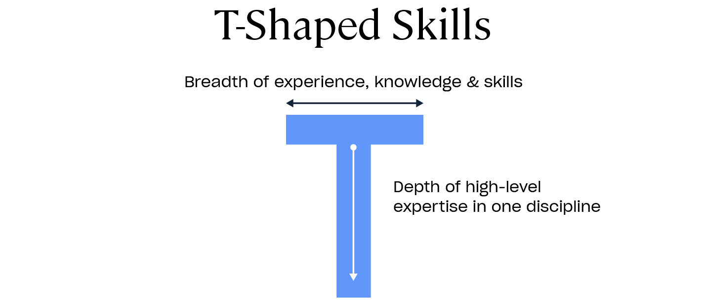

# Why Ruby?

By the end of this lesson, you'll understand why Ruby is a great first programming language, how it fits into the bigger picture of web development, and why it's worth learning, even if you don't end up using it in your first job.

## 1. From Static Pages to Real Applications

We've just learned HTML and CSS, which is great for making static web pages. But today's world runs on dynamic, database-connected applications, the kind you use every day:

- Social networks
- Streaming services
- SaaS (Software as a Service) tools
- Marketplaces
- and more

Ruby is a great language to bridge that gap. With Ruby (and Rails), you can:

- Store and retrieve data from databases
- Build user accounts, payment systems, and interactive features
- Create full-featured software, not just pretty pages

## 2. Learn the whole stack

Many coding courses teach one language or one skill in isolation, which leaves you with gaps in your knowledge. This course is training you to **think like a software engineer**. We'll learn the whole stack, learning everything needed to take an idea from concept to a deployed, working application with real users. That means:

- Product development skills to identify problems, write functional specifications, and understand *what* to build
- Front-end skills (HTML, CSS, JavaScript) for presentation
- Back-end skills (Ruby, Rails, databases) for logic and data
- Deployment skills to put your app online
- User interviewing and analytical skills to figure out what comes next
- Collaboration skills to work with other developers on a team

Why this matters:

- **Building something real is motivating**, you'll see the impact of your work immediately.
- You'll develop a *feel* for how software is built, which is invaluable for your career.
- **A long-term career foundation**: Once you understand programming in Ruby, you can transfer that knowledge to Python, JavaScript, Go, or any other language.
- **Momentum**: It's easier to learn your second language after your first. Ruby's beginner-friendly nature makes it a great launchpad.

## 3. T-Shaped Skills

A strong developer has a T-shaped skill set:

- **Breadth**: Understanding multiple areas of tech (databases, APIs, design, deployment).
- **Depth**: High-level expertise in at least one discipline.



Ruby on Rails helps you develop breadth by touching every part of an application and learning how they fit together.

<aside class="tip">
  After you deploy your capstone, you'll identify a niche and start developing your expertise.
</aside>

## 4. The Ruby on Rails Advantage

The biggest reason Ruby became famous is Ruby on Rails (often just "Rails"). Rails is a full-stack web framework that:

- Follows the MVC pattern (Model-View-Controller).
- Gives you sensible defaults so you don't have to reinvent the wheel.
- Lets you go from idea to working prototype fast.

<!-- TODO: add video to rails world -->

Rails is sometimes called a "one-person framework" because it allows a single developer to:

- Design
- Build
- Launch
- Maintain an entire application

And with AI tools improving rapidly, as Sam Altman (founder of OpenAI) puts it:

> "AI will make it possible for one person to build a billion dollar company very soon."
> [source](https://www.reddit.com/r/singularity/comments/1f9flw7/sam_altman_ai_will_make_it_possible_for_one/)

Rails makes that kind of productivity possible today, without needing a massive team.

## 5. Setup for Career Success

Learning Ruby & Rails reduces friction and increases your learning velocity because:

- The syntax is beginner-friendly but professional-grade.
- The framework follows conventions that prevent you from getting lost in complexity.
- You'll gain transferable skills for any programming language.

By learning the whole stack you'll:

- Understand how all the pieces fit together.
- Build confidence by deploying real projects.
- Develop taste, the ability to recognize good, maintainable code and design.

## 6. Why Ruby Works for Beginners

### Readable, forgiving syntax

Ruby code often reads like English. Try reading this Ruby code snippet. Can you guess what the output will be before running it?

```ruby
5.times do
  print "Hello!"
end
```
{: .repl }

Other languages are more verbose and imposing for beginners. This Java code snippet has the exact same output as the Ruby example, but requires more boilerplate and setup to run.

```java
public class HelloLoop {
  public static void main(String[] args) {
    for (int i = 0; i < 5; i++) {
      System.out.print("Hello!");
    }
  }
}
```

<aside class="tip">
  Many companies use Java. Don't be intimidated if you don't understand this code just yet. It's a great choice for your second (or third) programming language.
</aside>

## 7. Community & Conventions

Ruby and Rails have a culture of "convention over configuration", meaning:

- You follow standard ways of organizing your code.
- The framework does the repetitive work for you.
- You spend more time building features, less time making decisions about folder names or file locations.

The Ruby community is known for being:

- Welcoming to beginners.
- Rich in tutorials, gems (libraries), and open-source projects.
- Focused on sustainable, maintainable code.

## 8. Companies Using Ruby & Rails

Ruby isn't just for learning, it powers some of the world's biggest and most successful platforms:

- [Shopify](https://stackshare.io/shopify/shopify) – eCommerce giant supporting millions of online stores.
- [GitHub](https://stackshare.io/github/github) – The world's largest code hosting platform.
- [Airbnb](https://stackshare.io/airbnb/airbnb) – Marketplace for lodging and tourism experiences.
- [Basecamp](https://stackshare.io/basecamp/basecamp) – Project management software (created by the inventors of Rails).
- [Hulu](https://stackshare.io/hulu/hulu) – Video streaming service.
- [Instacart](https://stackshare.io/instacart/instacart) – Grocery delivery service.
- [Twitch](https://stackshare.io/twitch/twitch) - The world's leading video platform and community for gamers.
- [Coinbase](https://stackshare.io/coinbase/coinbase) - Digital wallet that allows you to securely buy, use, and accept cryptocurrency.
- [Twitter / X](https://stackshare.io/twitter/twitter) - Microblogging and social networking service

<aside class="tip">
  <strong>Practice Challenge</strong>: Pick one company from the list above. Visit its StackShare link. Identify at least two other technologies it uses alongside Ruby/Rails. Write down how those tools might interact in a real application.
</aside>

## 9. Why Ruby Is Still Worth Learning

Even if you never use Ruby in a job:

- **The skills transfer**: syntax changes, concepts don't.
- You'll understand OOP (Object-Oriented Programming) deeply.
- You'll be able to build real, usable web apps now, not "toy" examples.

As one long-time Rails developer put it:

> "After 7 years, I'd rather get better at tools that let me do a lot, than constantly chase the next trendy framework."
> [source](https://www.reddit.com/r/rubyonrails/comments/12nz0wm/comment/jgkp0za/?utm_source=share&utm_medium=web3x&utm_name=web3xcss&utm_term=1&utm_content=share_button)

## Practice Challenge

Think about something you'd like to build (e.g., a blog, a small game, a to-do list app).

- Write down what features it would have.
- Circle the parts that involve data (things you store), logic (things you compute), and presentation (things you display).

When we get to Rails, you'll see how these map perfectly to Models, Controllers, and Views.

## Wrap-Up

Key takeaways:

- Ruby bridges the gap from static pages to full, dynamic, database-driven web apps.
- Learning full-stack development exposes you to multiple areas of tech
- Rails is a "one-person framework" that enables rapid development and deployment.
- Many top companies use Ruby in production.
- Skills learned here will transfer to any tech stack.

**Next up**: We'll start exploring the building blocks of Ruby so you can write your first code.

## Quick Check

- Which of these are true about Ruby?
- It's beginner-friendly and has readable syntax.
  - Correct! Ruby is designed to be easy to read and write.
- It can only be used for web development.
  - Not correct—Ruby is also used for scripting, automation, data processing, and more.
- It has a large, helpful community.
  - Correct! The Ruby and Rails communities are known for being welcoming and resource-rich.
{: .choose_all #why_ruby title="Why Learn Ruby" answer="[1,3]"}

## References

- [The One Person Framework](https://world.hey.com/dhh/the-one-person-framework-711e6318)
- [Ruby on Rails: The Documentary](https://www.youtube.com/watch?v=HDKUEXBF3B4)
- [Rails is Omakase](https://dhh.dk/2012/rails-is-omakase.html)
- [The Rails Doctrine](https://rubyonrails.org/doctrine)
